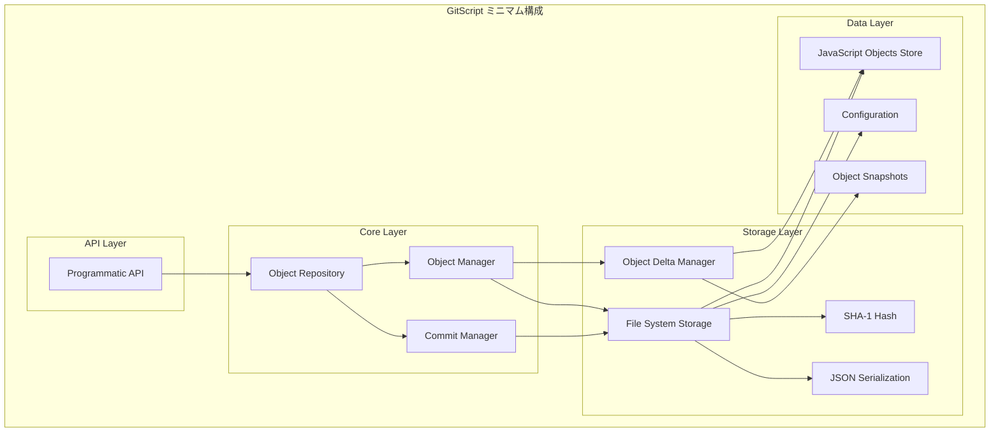

# GitScript ミニマム構成設計

## 概要

GitScript の最初の実装では、基本的な履歴管理機能に焦点を当てたミニマムな構成を採用します。
Git の概念と一貫した操作感を保ちながら、JavaScript オブジェクトの効率的な履歴管理を実現します。

## アーキテクチャ概要



## ミニマム機能セット

### 1. 基本操作（必須）

- `init` - オブジェクトリポジトリの初期化
- `add` - オブジェクトのステージング
- `commit` - 変更のコミット
- `status` - 状態の確認

### 2. 履歴操作（基本）

- `log` - コミット履歴の表示
- `show` - 特定コミットの詳細表示

## データ構造

### 1. ObjectSnapshot（オブジェクトスナップショット）

```typescript
interface ObjectSnapshot {
  hash: string; // オブジェクトのハッシュ
  data: any; // オブジェクトのデータ
  type: string; // データ型（object, array, set, map, primitive）
  timestamp: Date; // 作成日時
  version: number; // バージョン番号
}
```

### 2. DataDelta（データ差分）

```typescript
interface DataDelta {
  type: 'primitive' | 'object' | 'array' | 'set' | 'map';
  data: PrimitiveDelta | ObjectDelta | ArrayDelta | SetDelta | MapDelta;
  timestamp: Date;
  version: number;
}

interface ObjectDelta {
  type: 'object';
  operations: Map<string, PropertyDelta>;
}

interface ArrayDelta {
  type: 'array';
  operations: ArrayOperation[];
}
```

### 3. Commit（コミット）

```typescript
interface Commit {
  hash: string; // SHA-1ハッシュ
  message: string; // コミットメッセージ
  timestamp: Date; // 作成日時
  author: Author; // 作成者
  objects: string[]; // 変更されたオブジェクトのハッシュ
}
```

## ストレージ構造

```
.git/
├── objects/          # JavaScriptオブジェクトストア
│   ├── snapshots/    # オブジェクトスナップショット
│   ├── deltas/       # オブジェクト差分
│   └── commits/      # コミットオブジェクト
├── index             # ステージングエリア
├── config.json       # 設定ファイル
└── HEAD              # 現在のコミット
```

## 実装順序

### Phase 1: 基本データ構造

1. 型定義の実装
2. ハッシュ計算の実装
3. シリアライゼーションの実装

### Phase 2: ストレージ層

1. ファイルシステムストレージの実装
2. オブジェクトの保存・取得
3. 参照の管理

### Phase 3: オブジェクト差分管理

1. JavaScript オブジェクトの差分計算
2. 配列・Set・Map の差分計算
3. 差分の適用と復元

### Phase 4: コア機能

1. オブジェクトリポジトリの初期化
2. ステージングエリアの管理
3. コミットの管理

### Phase 5: API 層

1. プログラム API の実装
2. エラーハンドリングの実装
3. 型安全性の確保

## 制限事項

### 1. 機能制限

- ブランチ機能は含まない
- マージ機能は含まない
- リモートリポジトリ機能は含まない
- 高度なフック機能は含まない
- プラグインシステムは含まない

### 2. パフォーマンス制限

- 大きなファイルの最適化は含まない
- 分散処理は含まない
- 高度な圧縮は含まない

### 3. セキュリティ制限

- 暗号化機能は含まない
- 認証機能は含まない
- アクセス制御は含まない

## 拡張性の考慮

### 1. インターフェース設計

- 将来的な拡張を考慮したインターフェース設計
- 実装の交換可能性を保つ

### 2. 設定システム

- 基本的な設定機能のみ
- 将来的な拡張を考慮した構造

### 3. エラーハンドリング

- 基本的なエラーハンドリング
- 将来的な拡張を考慮した構造

## 使用例

```typescript
// オブジェクトリポジトリの初期化
const repo = await GitScript.init('/path/to/repo');

// オブジェクトのステージング
const userData = {
  name: 'John Doe',
  age: 30,
  hobbies: ['reading', 'coding'],
  profile: {
    bio: 'Software developer',
    location: 'Tokyo',
  },
};

await repo.add('user-1', userData);

// 変更のコミット
const commitHash = await repo.commit('Initial commit', {
  name: 'John Doe',
  email: 'john@example.com',
});

// 状態の確認
const status = await repo.status();
console.log(status);

// オブジェクトの更新
const updatedUserData = {
  name: 'John Doe',
  age: 31, // 年齢を更新
  hobbies: ['reading', 'coding', 'gaming'], // 趣味を追加
  profile: {
    bio: 'Senior Software developer', // プロフィールを更新
    location: 'Tokyo',
  },
};

await repo.add('user-1', updatedUserData);
const commitHash2 = await repo.commit('Update user profile');

// コミット履歴の表示
const history = await repo.log();
console.log(history);

// 特定コミットの詳細表示
const commitDetails = await repo.show(commitHash);
console.log(commitDetails);
```

## 設計の利点

### 1. ストレージ効率

- **大幅な容量削減**: オブジェクトの変更部分のみを保存
- **履歴の圧縮**: 長い履歴でも効率的な保存
- **重複排除**: 同じ内容のオブジェクトを共有

### 2. パフォーマンス

- **高速な更新**: 差分のみを計算・保存
- **効率的な復元**: 必要なバージョンのみを復元
- **メモリ効率**: 必要な部分のみを読み込み

### 3. Git 概念の活用

- **操作感の統一**: Git の概念との一貫性
- **学習コストの削減**: 既存の Git 知識の活用
- **直感的な操作**: コミット、ステージングなどの概念

## 次のステップ

1. **型定義の実装** - オブジェクト管理の型定義
2. **ハッシュ機能の実装** - SHA-1 ハッシュの計算
3. **ストレージ機能の実装** - ファイルシステムストレージ
4. **オブジェクト差分管理の実装** - 差分計算・適用
5. **コア機能の実装** - リポジトリ、ステージング、コミット管理
6. **API 層の実装** - プログラム API

このミニマム構成により、Git の概念と一貫した操作感を保ちながら、JavaScript オブジェクトに対して基本的な履歴管理機能を提供し、将来的な拡張の基盤を築くことができます。
